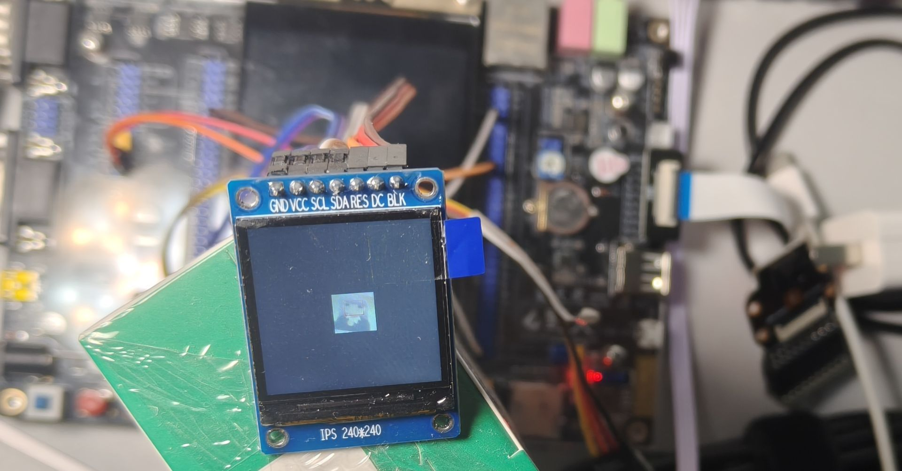

# A-lightweight-face-detection-model-deployed-on-STM32F407
I use STM32F407、little yolo(only 50k)、X-CUBE-AI、OV2640
# 轻量化人脸检测模型（STM32F407）
本项目实现了轻量化人脸检测模型YOLO在 STM32F407 上的部署。
yolo50k这个模型借鉴了dogqiuqiu
硬件接线及配置可以查看cubemx工程
I tried hard to store the camera's image data into the external RAM, but failed. It seems that there is some kind of "arbitration" issue between fsmc and dcmi.

## 效果展示

